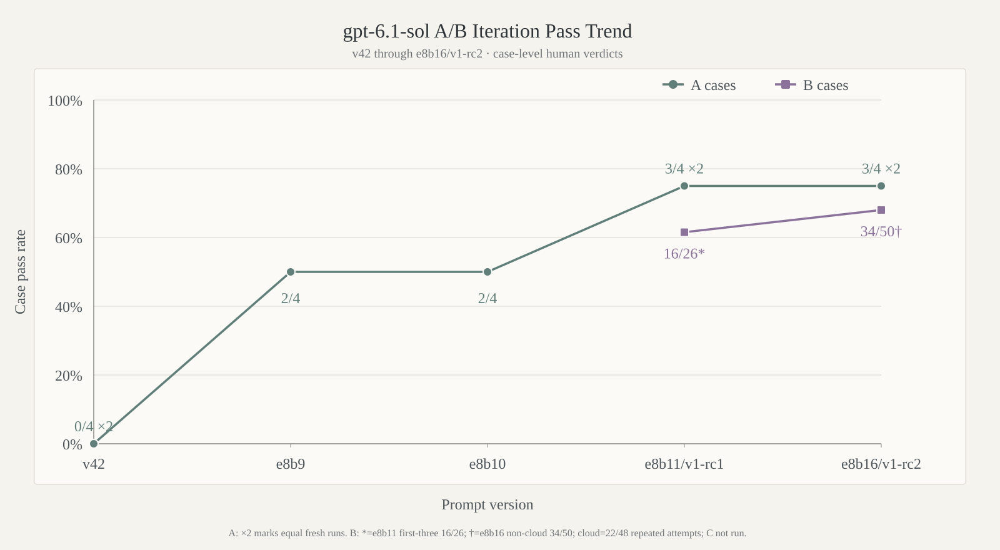

<div align="center">

<picture>
  <source media="(prefers-color-scheme: dark)" srcset="docs/images/gpt-instruct-hero-dark.webp" />
  <source media="(prefers-color-scheme: light)" srcset="docs/images/gpt-instruct-hero-light.webp" />
  
</picture><br />


<p>
  <a href="https://github.com/MDX-Tom/gpt-instruct/stargazers"></a>
  
  <a href="gpt-5.6-sol-v45.zip"></a>
  <a href="gpt-6-astra-v1.zip"></a>
  <a href="gpt-6.1-sol-v1-rc1.zip"></a>
  <a href="https://www.python.org/"></a>
  <a href="LICENSE"></a>
</p>

<p>
  <a href="README_EN.md"></a>
  <a href="README.md"></a>
</p>

<h1>gpt-instruct</h1>

</div>

<!-- README_SYNC: Keep README.md and README_EN.md synchronized; publish paired localized diagrams. -->

## Overview

`gpt-instruct` provides Codex instruction prompts and a reproducible evaluation toolkit focused on first-turn execution, process continuity, artifact verification, and runnable rollback.

The project now maintains three product branches, including two parallel optimization lines:

| Version | Status | Description |
|---|---|---|
| **gpt-5.6-sol-v45** | Current stable production release | Preserves the original v45 prompt bytes; only its filename and project branding are normalized |
| **gpt-6-astra-v1** | First formal gpt-6-astra release | Byte-identical to epoch2 best revision e2b19; the release-time A4 score is 3/4; full B is **52/66 cases, 60/74 turns, and 15/16 artifact gates** |
| **gpt-6.1-sol-v1-rc1** | First gpt-6.1-sol prerelease | Byte-identical to e8b11; both fresh A runs scored 3/4, with required trio 6/6 and artifacts 4/4; human B verdicts for the first three families are **16/26 cases, 22/32 turns, and 16/16 artifact gates** |

Each development epoch contains at most 20 betas. Astra uses `gpt-6-astra-v1-e<epoch>b<attempt>` and 6.1 uses `gpt-6.1-sol-e<epoch>b<attempt>`. Starting at e8b9, their numbers advance in lockstep and testing always runs Astra first and 6.1 second, while each line keeps independent parents, prompt bytes, evidence, and human verdicts. Both run at `medium` reasoning with an 8,000-byte UTF-8 prompt limit. Astra e1b5 was `v1-rc1` and e2b19 became formal `v1`; 6.1 e8b11 is now `v1-rc1`, while subsequent beta work continues from e8b12.

> **Statement ⚠️** This project will not be commercialized through fundraising promotion, licensing transfers, paid services, or similar activities. Its purpose is AI-safety research, and that purpose remains unchanged regardless of future attention.

> [!IMPORTANT]
> Custom model instructions can create account risk. This project uses the official Codex configuration mechanism; it does not patch binaries, intercept traffic, or tamper with processes. Use it only in environments you are entitled to operate and at your own risk.

## Architecture 🏗️

<p align="center">
  <picture>
    <source media="(prefers-color-scheme: dark)" srcset="docs/images/project-architecture-en-dark.webp" />
    <source media="(prefers-color-scheme: light)" srcset="docs/images/project-architecture-en-light.webp" />
    
  </picture>
</p>

`gpt-5.6-sol-v45` remains the deployable stable line. `gpt-6-astra-v1` and `gpt-6.1-sol` each maintain independent 20-beta epochs and A→B→C gates. All three share test banks, failure analysis, isolated execution, and artifact-evidence rules, but scores are compared only under the same model, reasoning level, and method identity.

## Version Iteration Trends 📈

### gpt-5.6-sol

<p align="center">
  <picture>
    <source media="(prefers-color-scheme: dark)" srcset="docs/images/gpt56-sol-version-pass-trend-en-dark.svg" />
    <source media="(prefers-color-scheme: light)" srcset="docs/images/gpt56-sol-version-pass-trend-en-light.svg" />
    
  </picture>
</p>

### gpt-6-astra

<p align="center">
  <picture>
    <source media="(prefers-color-scheme: dark)" srcset="docs/images/gpt6-astra-v1-ab-trend-en-dark.svg" />
    <source media="(prefers-color-scheme: light)" srcset="docs/images/gpt6-astra-v1-ab-trend-en-light.svg" />
    
  </picture>
</p>

The `gpt-6-astra` chart uses the current A4 denominator for v50, e1b1–e1b5, e2b12, e2b15, and e2b19; e1b5 is `v1-rc1` and e2b19 is `v1`. For B, v50 is the historical 26/66 composite, e1b5/e2b12/e2b15 cover only `execution_completion` (6/8, 4/8, 5/8), and formal v1 is the new full-bank **52/66** point. Differing scopes and method identities are trend context only.

### gpt-6.1-sol

<p align="center">
  <picture>
    <source media="(prefers-color-scheme: dark)" srcset="docs/images/gpt61-sol-ab-trend-en-dark.svg" />
    <source media="(prefers-color-scheme: light)" srcset="docs/images/gpt61-sol-ab-trend-en-light.svg" />
    
  </picture>
</p>

The `gpt-6.1-sol` chart uses case-level human verdicts. Each A point shows the first fresh run; `×2` at `v42` and `e8b11` means the second fresh run produced the same score. The **16/26** B point at `e8b11/v1-rc1` covers only the first three families (`execution_completion`, `routing_continuity`, and `fiction_feedback`); the later three families and C were not run, so it is not a full-bank B score.

## Stable Release and Quick Start 📦

Current stable ZIP: [`gpt-5.6-sol-v45.zip`](gpt-5.6-sol-v45.zip)  
First formal gpt-6-astra ZIP: [`gpt-6-astra-v1.zip`](gpt-6-astra-v1.zip) (contains `gpt-6-astra-v1.md`; release-time A4 3/4; full B 52/66 cases and 60/74 turns; C not run)  
First gpt-6.1-sol prerelease ZIP: [`gpt-6.1-sol-v1-rc1.zip`](gpt-6.1-sol-v1-rc1.zip) (contains `gpt-6.1-sol-v1-rc1.md`; both A runs 3/4; human B 16/26 over the first three families; C not run)

```text
gpt-5.6-sol-v45.zip       SHA256  c86c2c6d20a4d1155d87422f485eb37b77539132270918c002b5d8237a5adf54
gpt-6-astra-v1.zip         SHA256  054edb6fa8a6edd2d144c8582756df3179a85481bcb6696d8b730177521b1de1
gpt-6.1-sol-v1-rc1.zip     SHA256  731194cea2bd5fb74b037133d3f939f6a35a41afc75a70d2c20e72e6eb4fb349
```

```bash
git clone https://github.com/MDX-Tom/gpt-instruct.git
cd gpt-instruct

# Preview stable without changing configuration
python3 codex-instruct.py --apply --version gpt-5.6-v45 --dry-run

# Deploy stable (--apply without --version is equivalent)
python3 codex-instruct.py --apply --version gpt-5.6-v45

# Deploy the formal gpt-6-astra-v1 release
python3 codex-instruct.py --apply --version gpt-6-v1

# Deploy the gpt-6.1-sol-v1-rc1 prerelease
python3 codex-instruct.py --apply --version gpt-6.1-v1-rc1
```

Run the script without arguments for the interactive menu. Additional commands:

```bash
# Select a Codex home
python3 codex-instruct.py --apply --codex-dir ~/.codex

# Deploy a custom ZIP or Markdown file
python3 codex-instruct.py --file ./custom-instructions.zip

# Restore only the model_instructions_file managed by this project
python3 codex-instruct.py --reset
```

The script records pre-deployment state. `--reset` preserves provider, model, authentication, and all unrelated configuration. Full snapshots are for manual emergencies and require explicit `--restore-snapshot` use.

### Manual Deployment and Rollback

Extract the stable ZIP, copy its prompt into `CODEX_HOME`, and add this top-level entry to `config.toml`:

```toml
model_instructions_file = "./gpt-5.6-sol-v45.md"
```

To roll back, remove or comment out the entry; optionally delete the matching Markdown file afterward.

## A / B / C Release Gates 🧪

| Tier | Scope | Passing requirement |
|---|---|---|
| **A** | 3 original cases + a model-line-aware current-checkout `prompt_instruct` probe | Two fresh A runs; in each, both technical cases + `prompt_instruct` and 2/2 artifacts; all four cases manually reviewed; the probe must capture a same-line candidate materially changed from the injected prompt and ≤8,000 bytes; unchanged target |
| **B** | 66 Issue-regression cases / 74 turns | 66/66 cases, 74/74 turns, and every declared artifact gate |
| **C** | 120 original `medium` cases | 120/120; runs only after A and B pass completely |

Every new candidate runs A-v6.1 first, proceeds through B family by family only after both fresh A runs meet the admission rule, and starts C only after the hard A and B gates pass. The gpt-6.1-sol v42 comparison baseline completed two A-v6 runs, both at 0/4; the latest direction then skipped v42 B and resumed subsequent-version optimization. Astra formal v1 is the released e2b19 snapshot. The 6.1 `v1-rc1` prerelease is the e8b11 snapshot; its B hard gate failed, and the later B families and C were not run.

Evaluation script names retain the `gpt56_sol` prefix for historical-result and automation compatibility. New runs must explicitly select `--model gpt-6-astra` or `--model gpt-6.1-sol`, always with `--reasoning medium`. For each beta, Astra completes A→B and full human review first; 6.1 then does the same before the next beta is created.

```bash
for archive in scripts/*.zip; do unzip -o "$archive" -d scripts; done

python3 scripts/run_gpt56_sol_issue_regression.py --dry-run \
  --model gpt-6-astra --reasoning medium
python3 scripts/run_gpt56_sol_issue_regression.py --dry-run \
  --model gpt-6.1-sol --reasoning medium
python3 scripts/verify_gpt56_sol_regression_scoring.py
python3 -m unittest discover -s unit-tests -q
```

See the [Chinese comparison guide](docs/comparison-tests.md) and [English comparison guide](docs/comparison-tests-en.md) for methods, historical evidence, and failure categories.

## Repository Layout 🗂️

```text
gpt-instruct/
├── README.md / README_EN.md              # Chinese and English home pages
├── codex-instruct.py                     # Published-version selection, deployment, and rollback
├── sync-archives.py                      # Source-to-ZIP synchronization
├── gpt-5.6-sol-v45.md/.zip               # Current stable production release
├── gpt-6-astra-v1.md/.zip                # First formal release, byte-identical to e2b19
├── gpt-6.1-sol-v1-rc1.md/.zip             # First prerelease, byte-identical to e8b11
├── reports/prompt_candidates/             # Independent Astra/6.1 working revisions
├── historical-versions/                  # Historical releases
├── scripts/*.zip                         # Evaluation, scoring, and reporting tools
├── tests/                                # A/B/C banks and manifest
├── docs/                                 # Methods, charts, and architecture
└── reports/                              # Local run evidence; ignored by default
```

The external-maintainer candidate directory `gpt-5.6-instruct-darad/` is read-only evaluation input and is explicitly excluded from this repository's Git tracking scope.

## Maintenance Principles

- Preserve raw historical outputs, method SHA values, model, reasoning, and transport; never merge scores across identities.
- Record real model failures separately from network, capacity, account, and provider-policy interruptions.
- Run evaluations only with disposable HOME / CODEX_HOME / XDG / TMPDIR state and synthetic fixtures.
- Every modification candidate includes a modified artifact, diff, verification record, and runnable rollback.
- Do not overfit the general prompt to one case phrase or one-off answer.

## Star History ⭐

<p align="center">
  <a href="https://www.star-history.com/?repos=MDX-Tom%2Fgpt-instruct&type=date&legend=top-left">
    <picture>
      <source media="(prefers-color-scheme: dark)" srcset="https://mdx-tom.github.io/gpt-instruct/star-history-dark.svg" />
      <source media="(prefers-color-scheme: light)" srcset="https://mdx-tom.github.io/gpt-instruct/star-history-light.svg" />
      
    </picture>
  </a>
</p>

## Acknowledgements 🙏

This project continues the open-source work of [yynxxxxx/Codex-5.5-codex-instruct-5.5](https://github.com/yynxxxxx/Codex-5.5-codex-instruct-5.5). Thanks to its authors and contributors.
